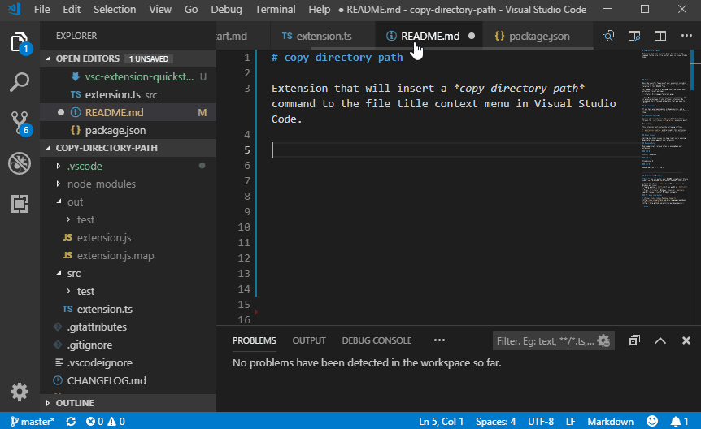

# copy-directory-path 

Extension that will insert a *copy directory path* command to the file title context menu in Visual Studio Code. 
Like *Current Dir. path to clipboard* in _Notepad++_.

## Requirements

## Extension Settings

## Known Issues

## Release Notes

### 1.0.0

Initial release of *copy-directory-path*.
